# P2 — pfSense Network Segmentation

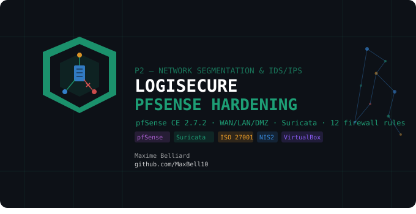

> **LogiSecure SA** · Enterprise Security Programme
> Firewall : `logisecure-pfsense` · LAN : `10.10.10.1` · DMZ : `10.10.20.1` · WAN : NAT

## Objective

Implement network segmentation for **LogiSecure SA** using pfSense CE as the perimeter firewall, enforcing zone isolation between the IT LAN, the DMZ, and the WAN. Deploy Suricata as an IDS/IPS, forward its detections to the Wazuh SIEM built in P1, and validate the infrastructure with OpenVAS vulnerability scanning.

Builds on [P1 — Active Directory & SIEM Foundation](https://github.com/MaxBell10/logisecure-active-directory) — pfSense is inserted as the default gateway for the existing DC01/WKS01/Wazuh infrastructure.

---

## Lab Architecture

```
INTERNET / WAN (VirtualBox NAT)
        │
[pfSense CE 2.7.2 — logisecure-pfsense.lab.local]
        │   WAN  : 10.0.2.15 (DHCP NAT)
        │   LAN  : 10.10.10.1/24
        │   DMZ  : 10.10.20.1/24
        │
        ├── [LAN IT — 10.10.10.0/24]
        │       DC01    10.10.10.10  Windows Server 2022
        │       WKS01   10.10.10.20  Windows 10 Pro
        │       Wazuh   10.10.10.30  Wazuh OVA v4.14.5
        │
        └── [DMZ — 10.10.20.0/24]
                Kali Linux  10.10.20.10  Test / attack host
                Web supplier-facing (planned)
                Cowrie honeypot → logisecure-honeypot-threat-intel
```

| VM | OS | IP | Role |
|---|---|---|---|
| logisecure-pfsense | FreeBSD (pfSense CE 2.7.2) | WAN: DHCP / LAN: 10.10.10.1 / DMZ: 10.10.20.1 | Firewall, Router, IDS/IPS |
| LOGISECURE-DC01 | Windows Server 2022 | 10.10.10.10 | Domain Controller, DNS (→ pfSense) |
| LOGISECURE-WKS01 | Windows 10 Pro | 10.10.10.20 | Domain-joined workstation |
| LOGISECURE-WAZUH | Amazon Linux 2023 (Wazuh OVA 4.14.5) | 10.10.10.30 | Wazuh SIEM (from P1) — receives Suricata DMZ alerts via syslog (§7) |
| Kali Linux (test) | Kali Linux | 10.10.20.10 (DMZ) · 10.10.10.50 (LAN) | Segmentation + detection tests from the DMZ; OpenVAS scanner from the LAN (see §6) |

---

## What Was Built

### 1. pfSense — Base Configuration

pfSense CE 2.7.2 deployed in VirtualBox with 3 interfaces (WAN/LAN/DMZ). Configured via console (interface assignment, IP setup) then hardened via WebGUI.

| Setting | Value |
|---|---|
| Hostname | `logisecure-pfsense` |
| Domain | `lab.local` |
| WebGUI | `https://10.10.10.1` (HTTPS port 443) |
| DNS | dnsmasq (Forwarder) → `10.0.2.3` (VirtualBox NAT DNS) |
| LAN interface | `em1` — `10.10.10.1/24` |
| DMZ interface | `em2` — `10.10.20.1/24` |

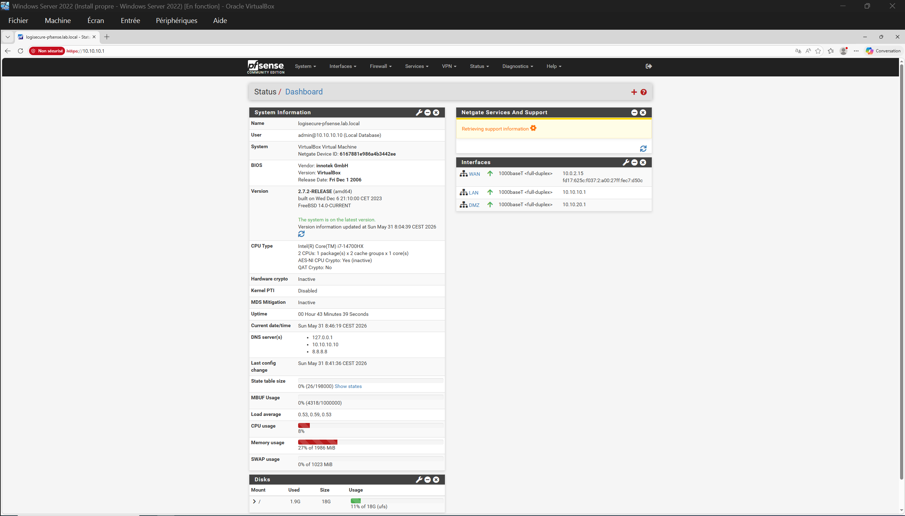

**Firewall Aliases:**

| Alias | Type | Value | Usage |
|---|---|---|---|
| `WEB_PORTS` | Port | 80, 443 | HTTP + HTTPS rules |
| `INTERNAL_NETS` | Network | 10.0.0.0/8 | All internal segments |
| `SURICATA_LAN_ONLY` | Network | 10.10.10.0/24 | Custom `$HOME_NET` for the DMZ Suricata instance (see §5) |

---

### 2. Firewall Rules — 12 Rules · 3 Interfaces

**KPI: ≥ 8 rules documented → 12 rules implemented ✅**

**LAN interface (5 rules) — Default Deny:**

| # | Action | Source | Destination | Port | Description |
|---|---|---|---|---|---|
| 1 | ✅ Pass | LAN subnets | LAN subnets | Any | Intra-zone — AD, Wazuh, DNS |
| 2 | ✅ Pass | LAN subnets | DMZ subnets | 443 | LAN → DMZ HTTPS only |
| 3 | ❌ Block+log | LAN subnets | DMZ subnets | Any | Block LAN → DMZ non-HTTPS |
| 4 | ✅ Pass | LAN subnets | Any | WEB_PORTS | LAN → Internet HTTP/HTTPS |
| 5 | ❌ Block+log | LAN subnets | Any | Any | **Default deny LAN** |

> The LAN tab also displays a sixth entry, the **Anti-Lockout Rule**, generated automatically by pfSense to prevent administrative lockout from the WebGUI. It is not user-defined and is excluded from the rule count above.

**DMZ interface (4 rules) — Default Deny:**

| # | Action | Source | Destination | Port | Description |
|---|---|---|---|---|---|
| 6 | ❌ Block+log | DMZ subnets | LAN subnets | Any | **CRITICAL — Block DMZ → LAN** |
| 7 | ❌ Block+log | DMZ subnets | INTERNAL_NETS | Any | Block DMZ → all internal nets |
| 8 | ✅ Pass | DMZ subnets | Any | WEB_PORTS | DMZ → Internet (updates) |
| 9 | ❌ Block+log | DMZ subnets | Any | Any | **Default deny DMZ** |

> Rules 6 and 7 overlap by design: `INTERNAL_NETS` (10.0.0.0/8) already contains the LAN subnet. Rule 6 exists as an explicit, separately named and separately logged control for the single most critical flow in the architecture, so that DMZ→LAN attempts are distinguishable at a glance in the firewall log rather than buried in a generic internal-networks deny.

**WAN interface (3 rules):**

| # | Action | Source | Destination | Port | Description |
|---|---|---|---|---|---|
| 10 | ✅ Pass | Any | DMZ subnets | 443 | WAN → DMZ HTTPS (supplier) |
| 11 | ❌ Block+log | Any | LAN subnets | Any | Block WAN → LAN |
| 12 | ❌ Block+log | Any | Any | Any | Default deny WAN |

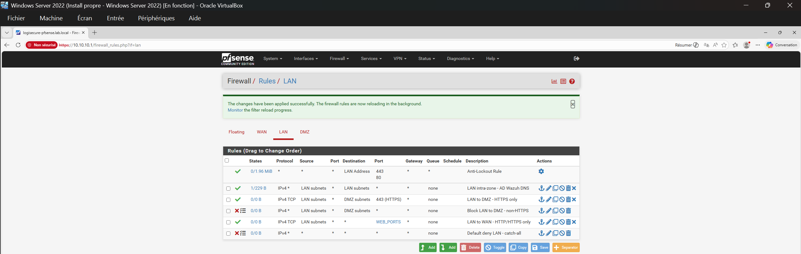

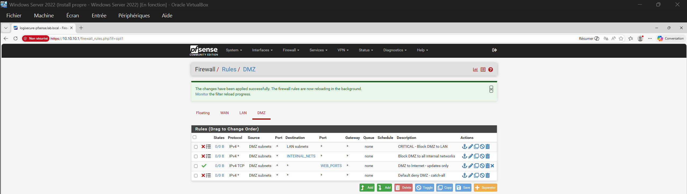

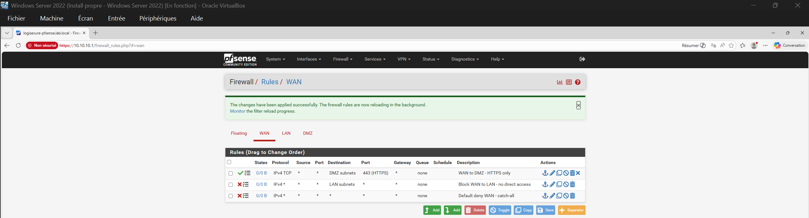

Full rationale for each rule in [`firewall-rules-justification.md`](./firewall-rules-justification.md).

---

### 3. Segmentation Tests — Proof of Isolation

**Test 1 — DMZ → LAN: BLOCKED ✅**

Kali Linux (10.10.20.10) placed in DMZ attempts to ping DC01 (10.10.10.10). pfSense logs one blocked entry per second under rule `CRITICAL - Block DMZ to LAN`.

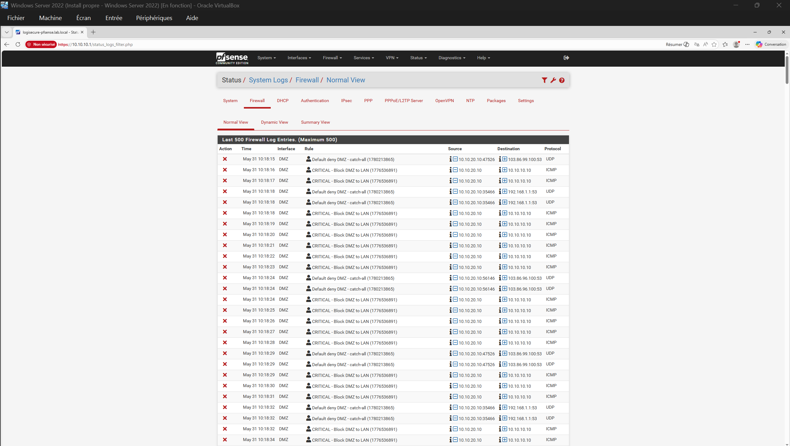

**KPI: 100% DMZ→LAN traffic blocked — confirmed by firewall logs ✅**

**Test 2 — LAN → Internet: PASSING ✅**

DC01 browses `https://www.google.com` via pfSense (NAT + dnsmasq forwarding). Confirmed via Diagnostics > DNS Lookup (3 msec) and browser.

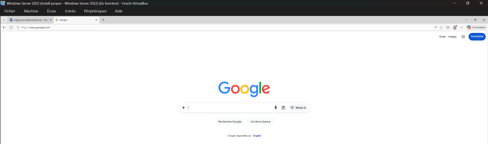

**Test 3 — DMZ → LAN: BLOCKED *and* DETECTED ✅**

A port scan from Kali (10.10.20.10) against DC01 (10.10.10.10) exercises both control layers on the same flow.

The scan reports every port as `filtered` — pf drops each SYN at the DMZ interface under `CRITICAL - Block DMZ to LAN`, one log entry per attempt. Prevention holds.

Suricata, running as a passive IDS on that same interface, still inspected the traffic and matched **ET SCAN** signatures (SID 2002910, SID 2010936) with `src_ip: 10.10.20.10` → `dest_ip: 10.10.10.10` on `em2` — mapping to **MITRE ATT&CK T1046 — Network Service Discovery**. Detection is not downstream of the firewall decision: the sensor reads what arrives on the interface, whether or not pf subsequently drops it.

Reaching this result required correcting the instance's `$HOME_NET` definition — see §5. Until that change, the sensor was receiving and logging the traffic while being structurally unable to alert on it.

Validated bottom-up, one layer at a time:

| Layer | Check | Result |
|---|---|---|
| 1 — Packets on interface | `tcpdump -i em2 -nn host 10.10.10.10` | SYN captured from 10.10.20.10 ✅ |
| 2 — Engine processing | DMZ instance `eve.json` | Flows logged on `em2` ✅ |
| 3 — Rule eligibility | `$HOME_NET` / `$EXTERNAL_NET` in generated config | DMZ moved to EXTERNAL_NET ✅ |
| 4 — Signature match | ET SCAN alert | `alert` event, correct src/dst ✅ |
| 5 — Firewall decision | `Status → System Logs → Firewall` | Block, rule `CRITICAL - Block DMZ to LAN` ✅ |

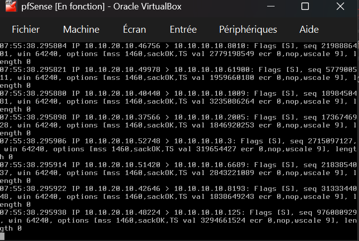

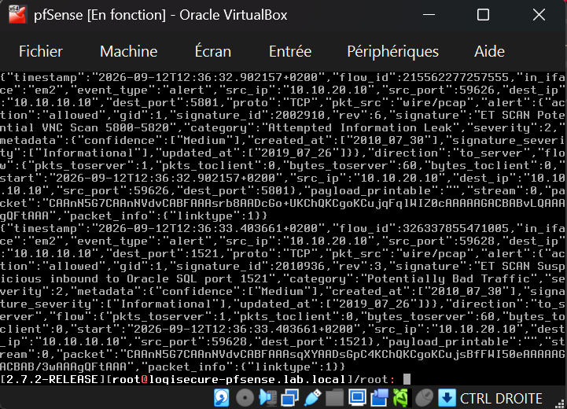

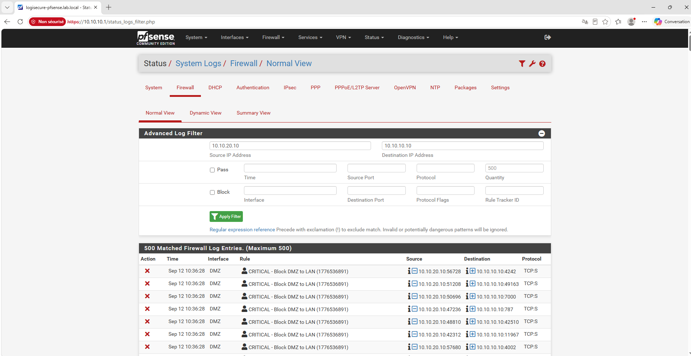

The full diagnostic path to this result — including two rounds of incorrect conclusions before the real cause was found — is documented in [`lessons_learned.md`](./lessons_learned.md).

---

### 4. DNS Configuration — Full Troubleshooting Chain

DNS resolution required a 5-step fix due to VirtualBox NAT constraints. Documented in detail in [`lessons_learned.md`](./lessons_learned.md).

| Step | Action | Result |
|---|---|---|
| 1 | Disabled DNSSEC in Unbound | Reduced timeout from ∞ to SERVFAIL |
| 2 | Switched DNS Resolver → DNS Forwarder (dnsmasq) | Simpler, no DNSSEC |
| 3 | Added `10.0.2.3` as DNS Server 1 in General Setup | VirtualBox NAT DNS — 75 msec |
| 4 | Enabled DNS Server Override | DHCP-provided DNS added automatically |
| 5 | `Set-DnsServerForwarder -IPAddress "10.10.10.1"` on DC01 | Browser DNS chain complete |

**Final DNS chain:** `DC01 DNS → pfSense dnsmasq (3 msec) → 10.0.2.3 → Internet`

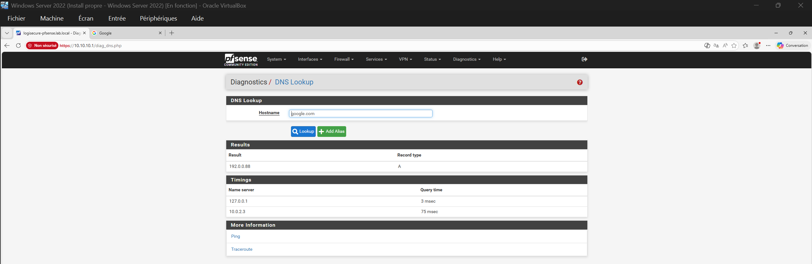

---

### 5. Suricata IDS/IPS

> **Status: Detection validated** — three instances deployed across all interfaces, ET Open rulesets applied, `$HOME_NET` tuned for internal segment monitoring, cross-segment detection test passed. DMZ sensor alerts forwarded to Wazuh — see §7.

| Interface | Instance | Blocking mode | Role |
|---|---|---|---|
| WAN (`em0`) | WAN IPS | **Inline IPS** | Perimeter — blocks on match |
| LAN (`em1`) | LAN IDS | Disabled (passive) | Internal visibility — alerts only |
| DMZ (`em2`) | DMZ IDS | Disabled (passive) | DMZ visibility — alerts only |

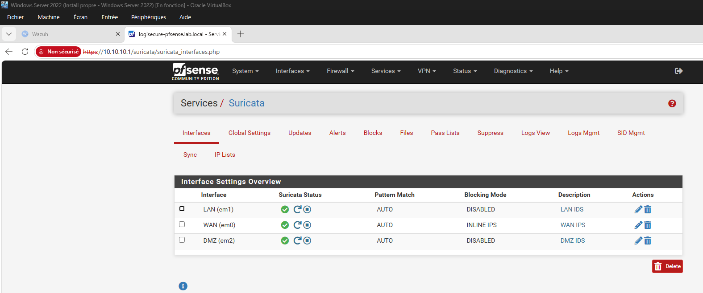

**`$HOME_NET` tuning — required for east-west detection.**

pfSense's default `Home Net` covers *all* locally attached networks, LAN and DMZ alike. Since ET Open scan signatures are written as `alert tcp $EXTERNAL_NET any -> $HOME_NET any`, a DMZ→LAN scan is `$HOME_NET → $HOME_NET` and can never match — the sensor logs the traffic and stays silent. All surface indicators (green status, correct interface, rules enabled, flows in `eve.json`) remain healthy while detection coverage is nil.

Both internal sensors therefore run a custom `Home Net` restricted to the LAN subnet, so that anything sourced outside `10.10.10.0/24` is evaluated as external:

| Setting | Value |
|---|---|
| Firewall alias | `SURICATA_LAN_ONLY` = `10.10.10.0/24` |
| Suricata Pass List | `lan_only` — all five auto-generated groups unchecked, alias referenced |
| DMZ instance `Home Net` | `lan_only` |
| LAN instance `Home Net` | `lan_only` |
| `External Net` (both) | `default` (= everything not in Home Net) |

Resulting engine configuration, verified in the generated YAML rather than in the UI:

```yaml
# DMZ instance (em2)
HOME_NET: "[10.10.10.0/24, 10.10.20.1/32, 127.0.0.1/32, ::1/128]"
EXTERNAL_NET: "[!$HOME_NET]"

# LAN instance (em1)
HOME_NET: "[10.10.10.0/24, 10.10.10.1/32, 127.0.0.1/32, ::1/128]"
EXTERNAL_NET: "[!$HOME_NET]"
```

In both cases the DMZ subnet is gone and only the sensor's own interface address remains, which is expected.

The WAN instance keeps the default `Home Net` deliberately: it is a perimeter sensor, and "everything internal is home, everything else is external" is exactly the semantics it needs.

> The *Local Networks* checkbox in the Pass List re-adds every locally attached subnet, DMZ included. Leaving it checked silently reverts the fix while the UI shows the custom list as applied.

**Scope of each internal sensor.** The LAN instance only observes traffic transiting `em1`. Since pf drops DMZ→LAN packets on ingress at `em2`, they never reach the LAN interface, and the LAN sensor stays silent on that scenario by design — the DMZ instance is the one that covers it. The LAN sensor's value lies elsewhere: LAN-sourced traffic toward the DMZ, and inbound traffic routed to the LAN.

**Known architectural limitation.** A gateway-mounted IDS only observes inter-segment traffic. Intra-VLAN reconnaissance and lateral movement inside `10.10.10.0/24` never traverse pfSense and are structurally invisible to these sensors. In this lab the Wazuh agents on DC01 and WKS01 partially cover that blind spot; closing it properly requires a SPAN/mirror port or a network TAP feeding the sensor.

---

### 6. OpenVAS / Greenbone — Vulnerability Scanning

> **Status: Scanned and validated** — GVM 25.04 deployed on the Kali host; two scans run against DC01 and WKS01. The first returned a clean-looking report that an independent nmap baseline contradicted, and was discarded. The corrected scan is the one reported below.

**Scanner deployment.** GVM 25.04 installed from the Kali repositories (`apt install openvas`, then `gvm-setup`), console at `https://127.0.0.1:9392`. Bringing it to a usable state required three manual repairs — PostgreSQL collation mismatch, missing `gvmd` database, manual admin creation — plus a multi-hour SCAP feed import before any scan could start. Documented in [`lessons_learned.md`](./lessons_learned.md).

**Scan position — a deliberate choice, not a workaround.**

Kali sits in the DMZ for the segmentation and detection work (§3). For vulnerability scanning it was moved to the LAN (`10.10.10.50`), because a scan launched from the DMZ measures the firewall rather than the hosts: every SYN is dropped at `em2` under `CRITICAL - Block DMZ to LAN`, and the report would restate §3 with a different tool. A vulnerability assessment asks *what is wrong with these hosts*, not *can this attacker reach them* — two questions needing two vantage points. Scanning from a position of trust is also how the exercise is performed in practice.

| Parameter | Value |
|---|---|
| Scanner | GVM 25.04 (Greenbone Community Edition) on Kali |
| Scanner position | LAN — `10.10.10.50` (temporary repositioning from the DMZ) |
| Targets | DC01 `10.10.10.10`, WKS01 `10.10.10.20` |
| Scan config | Full and fast |
| Alive test | Consider Hosts as Alive |
| Credentials | **None** — unauthenticated, black-box |

**Scan 1 — discarded (report `acf86b9a`, 08:23 UTC).**

Port list: `All IANA assigned TCP`. After 30 minutes, DC01 — the domain controller, the most exposed asset in the lab — returned **zero open ports, zero findings, operating system unidentified**. WKS01 returned a single port and one Medium. `Error Messages (0 of 0)`: the scan reported no problem of any kind.

That reads as a clean host. It is a blind scan. An `nmap -Pn 10.10.10.10` from the same Kali host, on the same segment, returned **13 open ports** and a full Active Directory service fingerprint in 8 seconds:

```
53/tcp   domain        389/tcp  ldap            3268/tcp globalcatLDAP
88/tcp   kerberos-sec  445/tcp  microsoft-ds    3269/tcp globalcatLDAPssl
135/tcp  msrpc         464/tcp  kpasswd5        5357/tcp wsdapi
139/tcp  netbios-ssn   593/tcp  http-rpc-epmap  5985/tcp wsman
                       636/tcp  ldapssl
```

**Cause.** `All IANA assigned TCP` covers several thousand ports. Windows hosts drop unsolicited SYNs silently instead of returning RST — nmap reports `987 filtered tcp ports (no-response)` for exactly that reason — so every closed port costs the scanner a full timeout rather than an immediate answer. DC01 spent 25 minutes exhausting timeouts and never reached the ports that were open.

**Fix.** A port list scoped to the services expected in a Windows domain, applied through a cloned target (GVM locks the port list of a target that already has a report):

| Object | Value |
|---|---|
| Port list `LogiSecure-Windows-Ports` | `T:53,88,135,139,389,445,464,593,636,3268,3269,3389,5357,5985,5986` |
| Target `LogiSecure-LAN-Targets-WinPorts` | Same two hosts, new port list |
| Task `LogiSecure-P2-LAN-Scan-WinPorts` | Full and fast |

**Scan 2 — retained (report `b78d205e`, 12:38 UTC).**

| | Scan 1 — `acf86b9a` | Scan 2 — `b78d205e` |
|---|---|---|
| Port list | All IANA assigned TCP | LogiSecure-Windows-Ports (15 ports) |
| DC01 — OS detection | Unidentified | Windows ✅ |
| DC01 — findings | 0 | 2 |
| Port entries (unfiltered) | 2 | 11 |
| CVEs tested and closed | 0 | 7 |
| Error messages | 0 | 2 (NVT timeouts) |
| Duration | 0:30 h | 0:58 h |

Findings, filtered at `min_qod=70`:

| Finding | Severity | QoD | Host | Port |
|---|---|---|---|---|
| DCE/RPC and MSRPC Services Enumeration Reporting | 5.0 Medium | 80% | DC01 `10.10.10.10` | 135/tcp |
| DCE/RPC and MSRPC Services Enumeration Reporting | 5.0 Medium | 80% | WKS01 `10.10.10.20` | 135/tcp |
| TCP Timestamps Information Disclosure | 2.6 Low | 80% | DC01 `10.10.10.10` | general/tcp |

**0 Critical · 0 High · 0 CVE.** That figure describes an unauthenticated scan, not the security posture of the hosts — see the limitations below.

**Residual limitations, stated rather than omitted.**

*Two tests never completed.* The retained report's `Error Messages` tab lists two NVTs that expired on DC01 — `Generic HTTP Directory Traversal / File Inclusion (Web Root) - Active Check` after 1800 s, and `GNU Bash Shellshock (CVE-2014-6271/6278) - Active Check` after 600 s. Those 40 minutes of timeout are also why DC01 alone accounts for 54 of the scan's 58 minutes. Coverage on those two vectors is **null, not negative**: the report is not evidence that DC01 is free of them.

*The scan is unauthenticated.* A black-box scan enumerates what answers on the network. It does not read the patch level, the registry, or the installed-updates list — which is where almost every Windows CVE is visible. `0 CVE` means *nothing observable from the network without credentials*, and nothing more. A credentialed scan with a dedicated read-only SMB account is what would produce genuinely remediable findings — carried over to a dedicated vulnerability-management project (see Status).

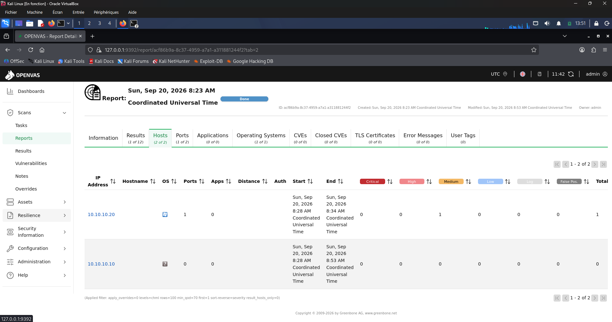

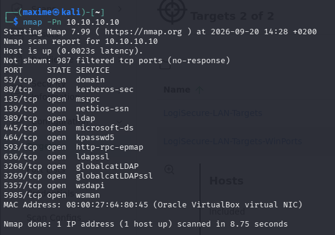

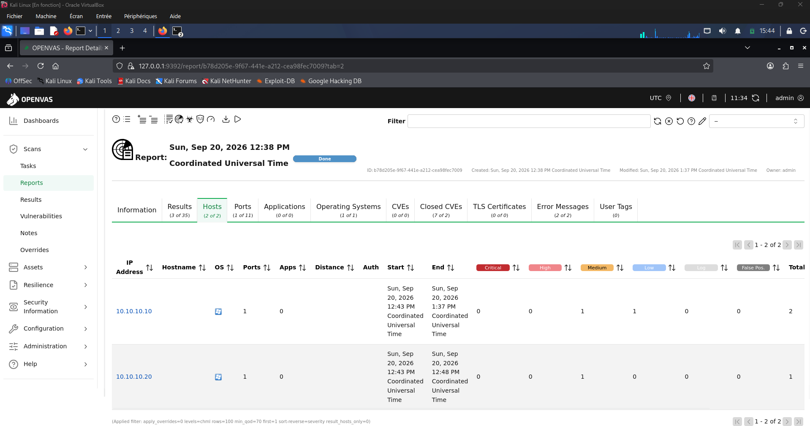

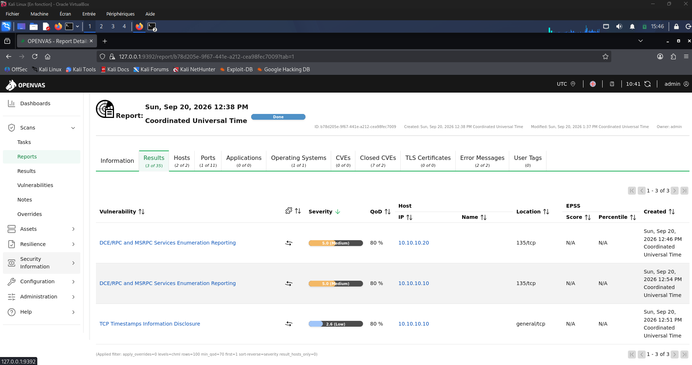

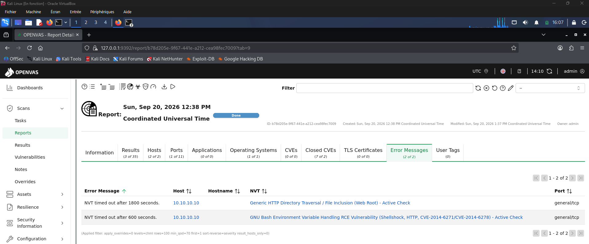

| KPI | Target | Actual | Status |
|---|---|---|---|
| Scan executed from a position of trust | DC01 + WKS01 | 2 hosts, Full and fast | ✅ |
| Scanner output validated against an independent baseline | Yes | nmap cross-check — scan 1 invalidated and redone | ✅ |
| Critical / High findings (unauthenticated) | Documented | 0 Critical · 0 High · 2 Medium · 1 Low | ✅ |
| Authenticated scan — patch-level assessment | Performed | Carried over — out of P2 scope | ➡️ |
| Remediation + rescan to 0 Critical | 0 | Nothing above Medium to remediate — see limitations | ⚠️ |

---

### 7. Suricata → Wazuh — SIEM Integration

> **Status: Operational** — DMZ sensor alerts reach the P1 Wazuh SIEM as structured alerts, classified by severity and mapped to MITRE ATT&CK. Only alerts leave the sensor: firewall logs and protocol telemetry are filtered at the source.

**Pipeline — four links, and a fault at any of them is silent:** nothing errors, the alert simply never appears.

```
Suricata DMZ instance (em2)
   │  EVE JSON — alerts (and drops) only
   ▼
syslog LOCAL1.NOTICE  →  pfSense syslogd
   │  RFC 5424 · "System Events" only · UDP 514
   ▼
Wazuh remoted  10.10.10.30  (allowed-ips 10.10.10.1)
   │
   ▼
decoder pfsense-suricata  →  rules 100200 / 100201 / 100202  →  dashboard
```

| Link | Setting | Value |
|---|---|---|
| Suricata DMZ instance | EVE output type | `SYSLOG` — facility `LOCAL1`, priority `NOTICE` |
| | Alert payload | `PRINTABLE` only, packet dump off — keeps each alert within a syslog datagram |
| | EVE logged traffic / info | **None** — alerts and drops only |
| pfSense syslog | Log message format | syslog (RFC 5424) |
| | Remote server | `10.10.10.30:514` |
| | Remote syslog contents | **System Events** only |
| Wazuh manager | Remote block | `syslog` · UDP 514 · `allowed-ips 10.10.10.1` |
| | Decoder | `pfsense-suricata` (custom) |
| | Rules | `100200`–`100202` (custom) |

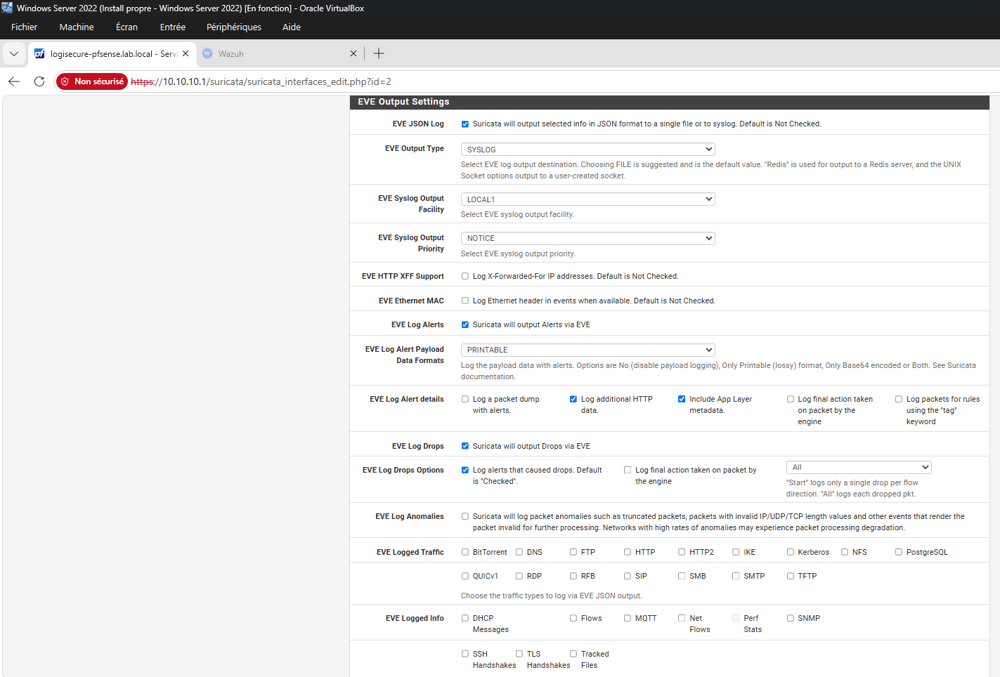

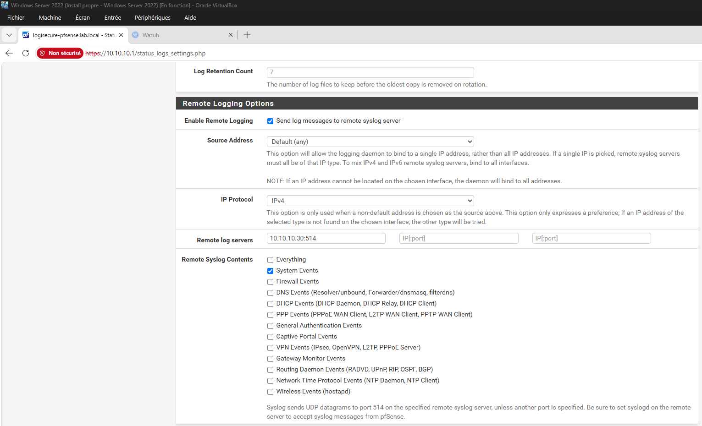

**Wazuh reception** — a second `<remote>` block, alongside the untouched agent channel (1514/tcp):

```xml
<remote>
  <connection>syslog</connection>
  <port>514</port>
  <protocol>udp</protocol>
  <allowed-ips>10.10.10.1</allowed-ips>
</remote>
```

**Transport proven before decoding.** A capture on the Wazuh host during a scan shows the alerts arriving from pfSense as `local1.notice` datagrams — the exact facility and priority configured on the sensor:

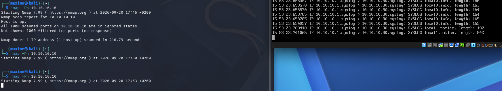

**Received is not understood.** The alerts were in Wazuh's archive, yet no Wazuh alert was generated. `wazuh-logtest` showed why, format by format:

| pfSense format | Wazuh pre-decoding | Decoder | Outcome |
|---|---|---|---|
| BSD (RFC 3164, default) | Hostname absent from forwarded messages → `suricata[23921]:` read as the hostname, no program name left | None | Generic rule **1002** *"Unknown problem somewhere in the system"*, level 2 — matched on the word *Bad* in `Potentially Bad Traffic`, then discarded under the alert threshold |
| RFC 5424 | Header not recognised at all | None | No rule |
| RFC 5424 + custom decoder | Header matched by the decoder's prematch | `pfsense-suricata` → JSON fields | Rules **100201** / **100202** — alert generated |

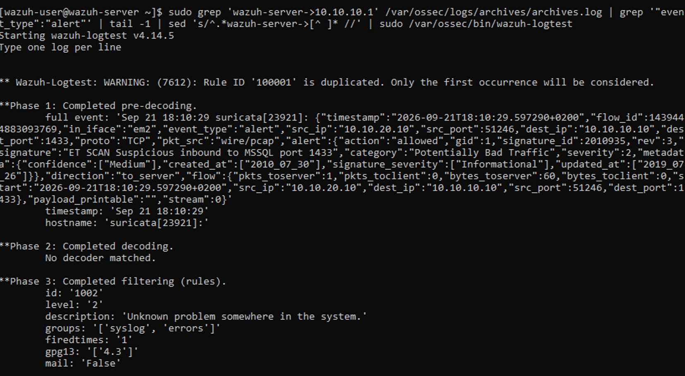

Neither syslog format pfSense can emit is parsed by Wazuh's stock pre-decoder. Any further pfSense source forwarded this way will need its own decoder.

**Custom decoder** — matches the RFC 5424 header of Suricata's messages, then hands the remainder to Wazuh's JSON decoder:

```xml
<decoder name="pfsense-suricata">
  <prematch>^1 \S+ \S+ suricata \d+ - - </prematch>
  <plugin_decoder offset="after_prematch">JSON_Decoder</plugin_decoder>
</decoder>
```

**Custom rules:**

```xml
<group name="ids,suricata,pfsense,">
  <rule id="100200" level="0">
    <decoded_as>pfsense-suricata</decoded_as>
    <description>pfSense Suricata EVE event</description>
  </rule>

  <rule id="100201" level="3">
    <if_sid>100200</if_sid>
    <field name="event_type">^alert$</field>
    <description>Suricata alert (pfSense): $(alert.signature)</description>
  </rule>
</group>

<group name="ids,suricata,pfsense,">
  <rule id="100202" level="6">
    <if_sid>100201</if_sid>
    <field name="alert.signature">^ET SCAN</field>
    <description>Suricata (pfSense): network scan detected - $(alert.signature)</description>
    <mitre>
      <id>T1046</id>
    </mitre>
  </rule>
</group>
```

Rule `100202` exists because the first version filed every alert at level 3 — which on Wazuh's scale means *successful or authorized events*. Scan signatures are raised to level 6 (*frequent IDS events*) and mapped to **T1046 — Network Service Discovery**; Wazuh resolves the tactic and technique names from the ID alone. The prefix match covers the whole `ET SCAN` family: an `Oracle SQL port 1521` scan signature never seen during development was classified correctly on first arrival.

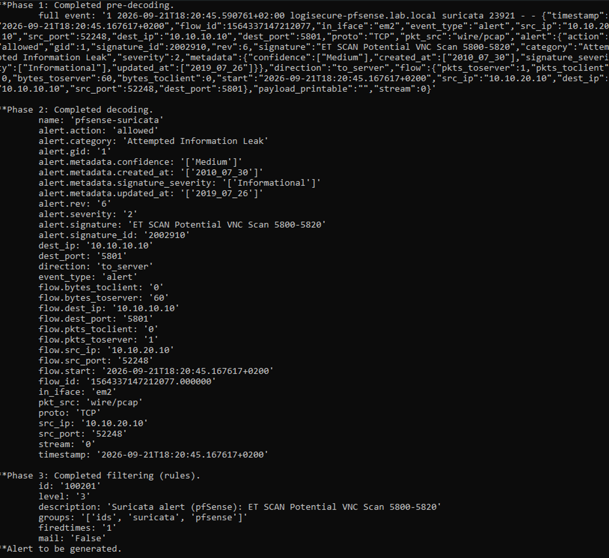

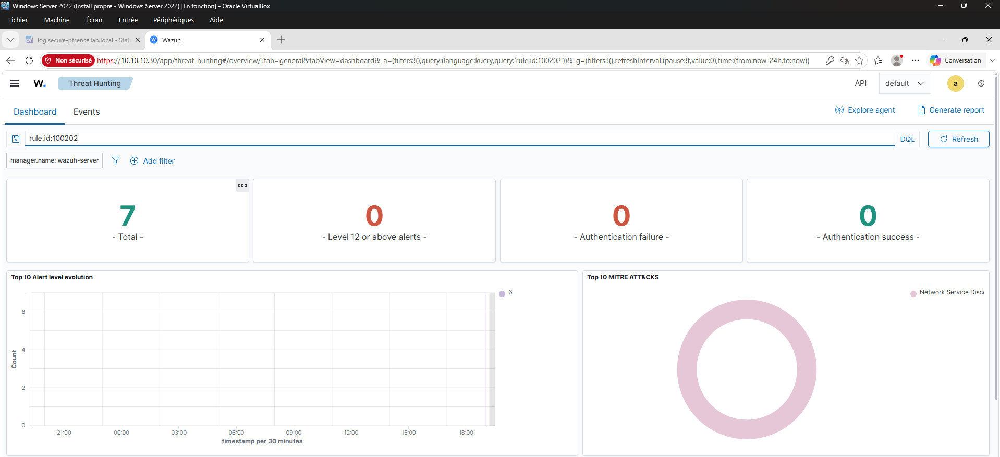

**Noise filtered at the source — proven, not assumed.**

| Source of volume | Fix | Proof |
|---|---|---|
| pfSense *Everything* forwarding — one `filterlog` line per blocked SYN, roughly a thousand per default nmap run | Remote contents → System Events only | Last `filterlog` line received 17:16:06 UTC; scan alerts still arriving at 17:23:38 |
| Suricata EVE protocol telemetry — DNS, Kerberos, SMB… on a segment where a domain controller answers constantly | All EVE logged traffic / info unchecked | Last DNS event 17:29:05 UTC — unchanged nine minutes later, and unchanged after a DNS query forced from Kali |

The second fix had already been "applied" the day before: the checkboxes were cleared on screen but never saved. See [`lessons_learned.md`](./lessons_learned.md).

**Notes for an analyst reading these alerts.**

- **Agent = `wazuh-server`.** Syslog sources are not agents: every pfSense alert is attributed to the manager itself. Filter on `rule.groups:pfsense`, not on agent name.
- **`"action": "allowed"`** is Suricata's own verdict as a passive IDS, not the firewall's. pf dropped the same packets — the `filterlog` entries prove it. Prevention and detection are separate claims (§3).
- **Two clocks.** Wazuh stamps in UTC, pfSense in local time (UTC+2 here). Both are correct; correlating across sources means normalising first.

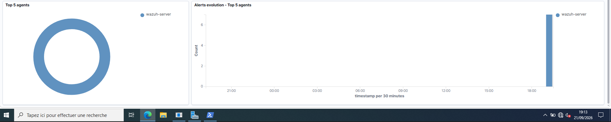

**Known limitations.**

- Only the **DMZ** sensor is forwarded. The WAN inline IPS and the LAN IDS still write to local files — the perimeter IPS blocks traffic the SIEM never sees.
- Non-scan Suricata alerts keep level 3 through rule `100201`. A mapping from Suricata's `alert.severity` to Wazuh levels is not implemented.
- Transport is plain UDP syslog: unauthenticated (the `allowed-ips` source address is trivially spoofed over UDP), unencrypted, and lossy under load. Acceptable on an isolated lab segment, not beyond it.

| KPI | Target | Actual | Status |
|---|---|---|---|
| Suricata alerts received by the SIEM | Yes | `local1.notice` datagrams captured on Wazuh | ✅ |
| Alerts decoded and raised as Wazuh alerts | Yes | Rules 100201 / 100202 — visible in the dashboard | ✅ |
| Scan detections mapped to MITRE ATT&CK | T1046 | **Network Service Discovery** in the dashboard | ✅ |
| Only alerts forwarded | No firewall / protocol telemetry | Verified — timestamps + positive control | ✅ |
| WAN / LAN sensors forwarded | — | Not implemented | 📋 |

---

## Tech Stack


| Tool | Version | Usage |
|---|---|---|
| pfSense CE | 2.7.2-RELEASE | Firewall, Router, DNS Forwarder |
| Suricata | (pfSense package) | IDS/IPS — 3 instances, ET Open rulesets |
| VirtualBox | 7.x | Hypervisor — internal networks |
| Kali Linux | Rolling | Segmentation + detection test host (DMZ) |
| Greenbone / OpenVAS | GVM 25.04 (Kali package) | Vulnerability scanner — unauthenticated LAN scans |
| nmap | 7.99 | Independent baseline used to validate the scanner |
| Wazuh | 4.14.5 (OVA, from P1) | SIEM — Suricata DMZ alerts via syslog, custom decoder and rules |
| dnsmasq | (pfSense built-in) | DNS Forwarder → 10.0.2.3 |

---

## Repository Structure

```
logisecure-pfsense-segmentation/
├── README.md
├── p2_logo.svg
├── lessons_learned.md
├── firewall-rules-justification.md
└── screenshots/
    ├── 00_pfsense_base/         # Console — interfaces, hostname, audit log
    ├── 01_interfaces_webgui/    # WebGUI — login, dashboard, general setup, port
    ├── 02_firewall_rules/       # Aliases, LAN/DMZ/WAN rules
    ├── 03_segmentation_tests/   # Kali DMZ config, blocked logs, internet test
    ├── 04_suricata/             # Suricata config, HOME_NET fix, detection test
    ├── 05_openvas/              # GVM scans 1 & 2, nmap baseline, NVT timeouts
    └── 06_wazuh_integration/    # Suricata → syslog → Wazuh pipeline, decoder, rules, dashboard
```

---

## KPI Dashboard

| KPI | Target | Actual | Status |
|---|---|---|---|
| Firewall rules documented | ≥ 8 | **12 rules** | ✅ |
| DMZ→LAN traffic blocked | 100% | **Confirmed by logs** | ✅ |
| Default deny on each interface | Yes | **3 interfaces** | ✅ |
| Critical logging on blocked flows | Yes | **7 logged rules** | ✅ |
| Suricata alerts detected | ≥ 1 test | **ET SCAN / T1046 validated** | ✅ |
| Sensor `$HOME_NET` scoped for east-west detection | Both internal sensors | **LAN + DMZ instances** | ✅ |
| Suricata → Wazuh integration | Operational | **DMZ sensor · rules 100201 / 100202 · T1046 mapped** | ✅ |
| Only alerts forwarded to the SIEM | No firewall / protocol telemetry | **Verified — timestamps + positive control** | ✅ |
| OpenVAS scan executed + validated against a baseline | Yes | **2 hosts · nmap cross-check** | ✅ |
| OpenVAS Critical / High findings (unauthenticated) | Documented | **0 Critical · 0 High · 2 Medium · 1 Low** | ✅ |
| OpenVAS authenticated scan (patch level) | Performed | `Carried over — out of P2 scope` | ➡️ |
| OpenVAS critical vulns after remediation | 0 | `Nothing above Medium to remediate — see §6` | ⚠️ |

---

## Status

| # | Step | Status |
|---|---|---|
| 1 | pfSense VM + 3 interfaces (WAN/LAN/DMZ) | ✅ Done |
| 2 | WebGUI config (hostname, DNS, port 443) | ✅ Done |
| 3 | Firewall Aliases (WEB_PORTS, INTERNAL_NETS) | ✅ Done |
| 4 | LAN rules — 5 rules incl. default deny | ✅ Done |
| 5 | DMZ rules — 4 rules incl. default deny | ✅ Done |
| 6 | WAN rules — 3 rules incl. default deny | ✅ Done |
| 7 | Segmentation test — DMZ→LAN blocked (logs) | ✅ Done |
| 8 | DNS troubleshooting — dnsmasq + DC01 forwarder | ✅ Done |
| 9 | Gateway switchover — DC01 | ✅ Done |
| 10 | Gateway switchover — WKS01 + Wazuh | ✅ Done |
| 11 | Suricata — interface config + rulesets | ✅ Done |
| 12 | Suricata — `$HOME_NET` scoping + cross-segment detection test | ✅ Done |
| 13 | Suricata — `$HOME_NET` scoping on LAN instance | ✅ Done |
| 14 | Suricata → Wazuh integration — DMZ sensor, syslog, custom decoder + rules | ✅ Done |
| 15 | OpenVAS — GVM 25.04 deployment + LAN scan (DC01, WKS01) | ✅ Done |
| 16 | OpenVAS — scan invalidated by nmap baseline, port list corrected, rescan | ✅ Done |
| 17 | OpenVAS — authenticated scan (read-only SMB account) for patch-level findings | ➡️ Carried over |
| 18 | Remediation + rescan | ➡️ Carried over |
| 19 | pfSense configuration baseline exported — kept out of the repository (contains secrets) | ✅ Done |

> Steps 17–18 were deliberately moved out of P2. P2 covers segmentation and detection; credentialed scanning and a full remediation cycle belong to a dedicated vulnerability-management project later in the programme. The unauthenticated scan and its limits are documented in §6.
